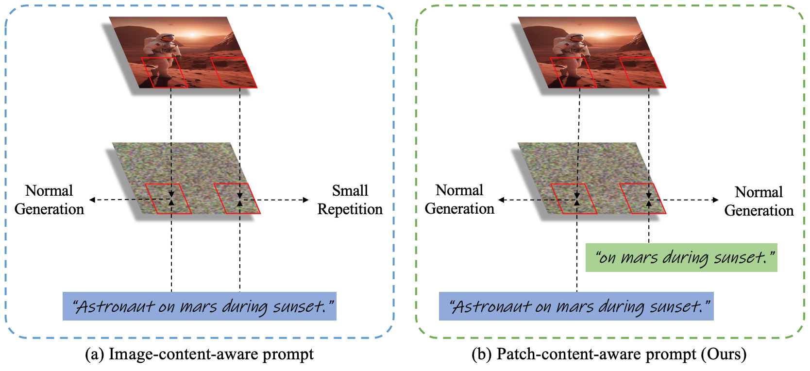
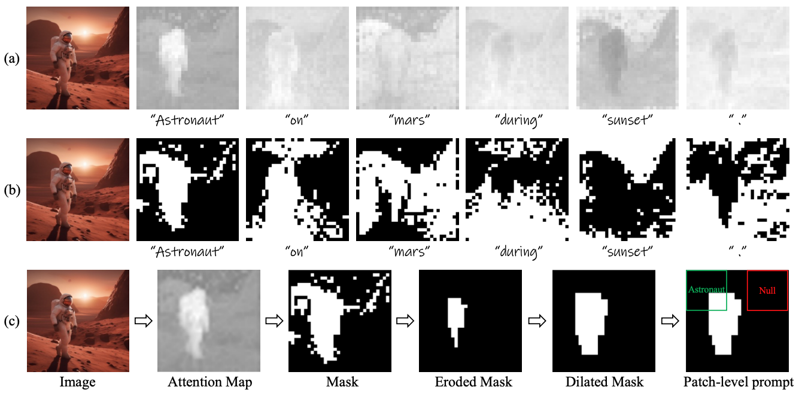
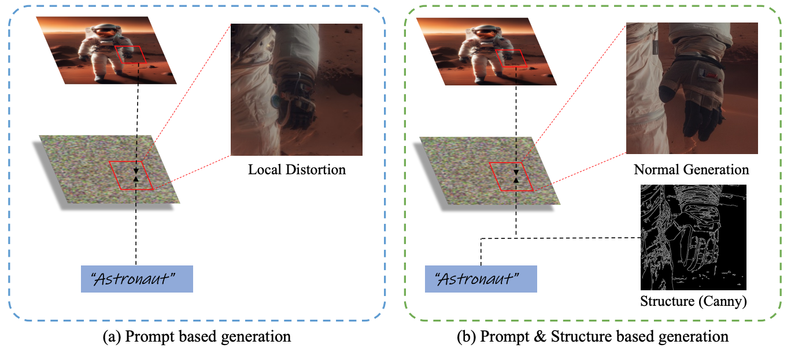
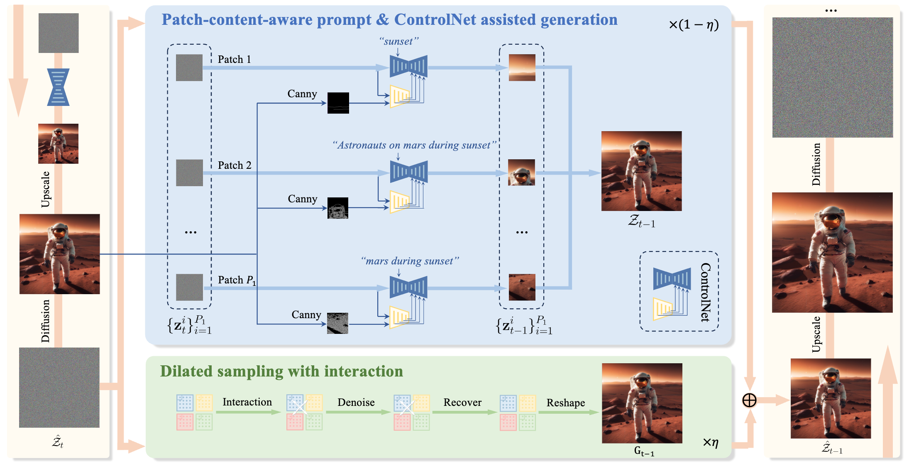
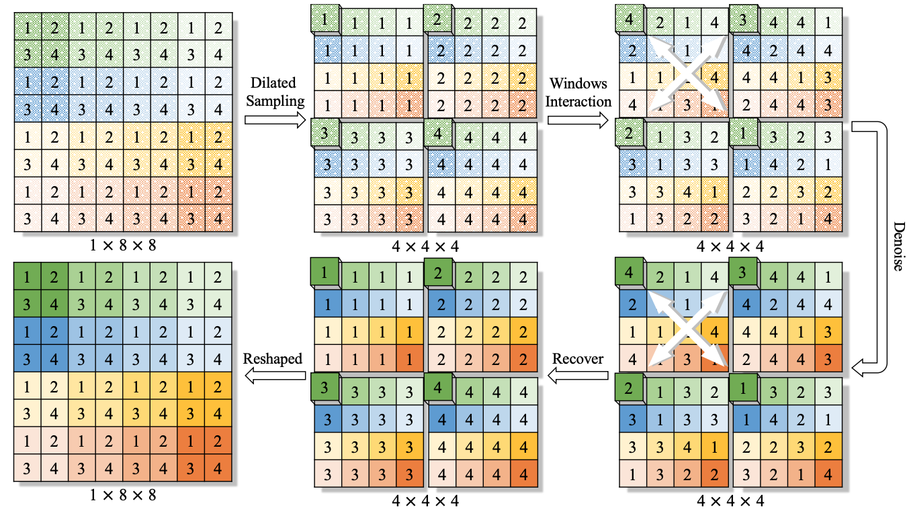
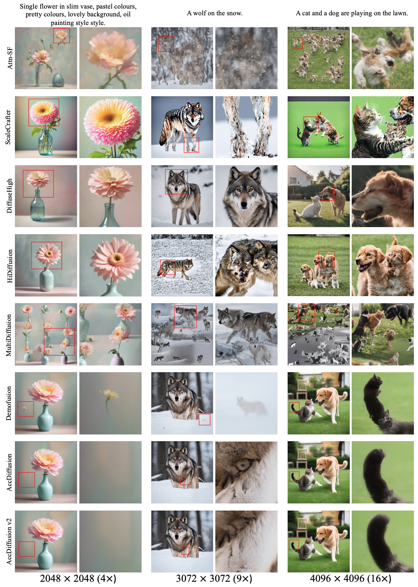
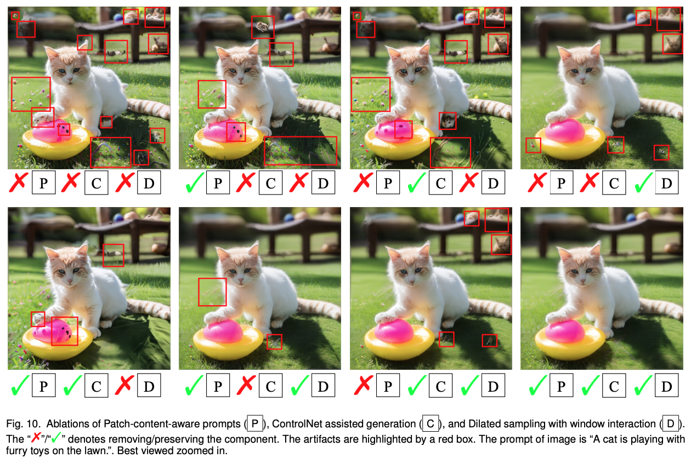

# AccDiffusion v2
Code release for "AccDiffusion v2: Towards More Accurate
Higher-Resolution Diffusion Extrapolation".

A preliminary version of this paper, termed [AccDiffusion](https://arxiv.org/abs/2407.10738v1), can be referred to the publication. Building on that version, AccDiffusion v2 further explores the cause of local distortion in higher-resolution image generation and introduces AccDiffusion v2 to suppress it effectively.

## Abstract
Diffusion models suffer severe object repetition and local distortion when the inference resolution differs from its pre-trained resolution. We propose AccDiffusion v2, an accurate method for patch-wise higher-resolution diffusion extrapolation without training. Our in-depth analysis in this paper shows that using an identical text prompt for different patches leads to repetitive generation, while the absence of a prompt undermines image details. In response, our AccDiffusion v2 novelly decouples the vanilla image-content-aware prompt into a set of patch-content-aware prompts, each of which serves as a more precise description of a patch. Further analysis reveals that local distortion arises from inaccurate descriptions in prompts about the local structure of higher-resolution images. To address this issue, AccDiffusion v2, for the first time, introduces an auxiliary local structural information through ControlNet during higher-resolution diffusion extrapolation aiming to mitigate the local distortions. Finally, our analysis indicates that global semantic information is conducive to suppressing both repetitive generation and local distortion. Hence, our AccDiffusion v2 further proposes dilated sampling with window interaction for better global semantic information during higher-resolution diffusion extrapolation. We conduct extensive experiments, including both quantitative and qualitative comparisons, to demonstrate the efficacy of our AccDiffusion v2. The quantitative comparison shows that AccDiffusion v2 achieves state-of-the-art performance in image generation extrapolation without training. The qualitative comparison intuitively illustrates that AccDiffusion v2 effectively suppresses the issues of repetitive generation and local distortion in image generation extrapolation.

## Patch-Content-Aware Prompts



First, our in-depth analysis indicates, as illustrated in the Figure, small object repetitive generation is the adversarial outcome of an identical text prompt on all patches, encouraging to generate repetitive objects, and global semantic information, suppressing the generation of repetitive objects.



Hence, we propose to decouple the vanilla image-content-aware prompt into a set of patch-content-aware substrings, each of which serves as a more precise prompt to describe the patch contents. Specifically, we utilize the cross-attention map from the low-resolution generation process to determine whether a word token should serve as the prompt for a patch. If a word token has a high response in the cross-attention map region corresponding to the patch, it should be included in the prompt, and vice versa.

## More Accurate Generation of Local Content

Secondly, we find that patch-content-aware prompt suppresses the repetitive generation effectively, but local distortion persists in higher-resolution images. 
We further analyze that local distortion is the adversarial outcome of inaccurate prompts, encouraging to generate overall structures, and global semantic information, encouraging to generate local structures.



Hence, we provide an additional structure condition for patch-wise generation to suppress the influence of inaccurate prompts. Specifically, we inject the structure information of low-resolution generation into stable diffusion during patch-wise denoising through ControlNet, suppressing distortion well. 

## Dilated Sampling with Window Interaction



Finally, recent works show that accurate global semantic information is conducive to suppressing repetitive generation and local distortion simultaneously. Previous work (Demofusion) uses dilated sampling to provide global semantic information for higher-resolution generation. However, we observe that the conventional dilated sampling generates globally inconsistent and noisy information, disrupting the generation of higher-resolution images.  Such inconsistency stems from the independent denoising of dilation samples without interaction.  In response, we employ a position-wise bijection function to enable interaction between the noise from different dilation samples. 

##   Qualitative comparison of our AccDiffusion v2 with existing training-free image generation extrapolation methods



## Ablation study

When all modules are removed, the image shows the most repetitive objects; however, using all modules together effectively prevents both repetitions and local distortion. This demonstrates that these modules function collectively to minimize artifacts.

## Experiments environment
### Set up the dependencies as:
```
conda create -n AccDiffusion python=3.9
conda activate AccDiffusion
pip install -r requirements.txt
```

## Higher-image generation
```
python accdiffusion_plus.py --experiment_name="AccDiffusionv2" \
    --model_ckpt="stabilityai/stable-diffusion-xl-base-1.0" \ # your sdxl model ckpt path
    --prompt="a cat and a dog are playing on the lawn." \
    --num_inference_steps=50 \
    --seed=2 \
    --resolution="4096,4096" \
    --upscale_mode="bicubic_latent" \
    --stride=64 \
    --c=0.3 \ # c can be adjusted based on the degree of repetition and quality of the generated image
    --use_progressive_upscaling  --use_skip_residual --use_multidiffusion --use_dilated_sampling --use_guassian \
    --use_md_prompt    --shuffle   --use_controlnet  --controlnet_conditioning_scale 0.6
``` 
The hyperparameters c can be adjusted based on the degree of repetition and quality of the generated image. The quality of the high-resolution images generated is greatly related to the seed. 


## Reference
[1] [Sdxl: improving latent diffusion models for high-resolution image synthesis.](https://arxiv.org/abs/2307.01952)
[2] [Designing a practical degradation model for deep blind image super-resolution.](https://arxiv.org/abs/2103.14006)
[3] [Adding conditional control to text-to-image diffusion models.](https://arxiv.org/abs/2302.05543)
[4] [DemoFusion: Democratising High-Resolution Image Generation With No $$$](https://arxiv.org/abs/2311.16973)
[5] [AccDiffusion: An Accurate Method for Higher-Resolution Image Generation](https://arxiv.org/abs/2407.10738v1)